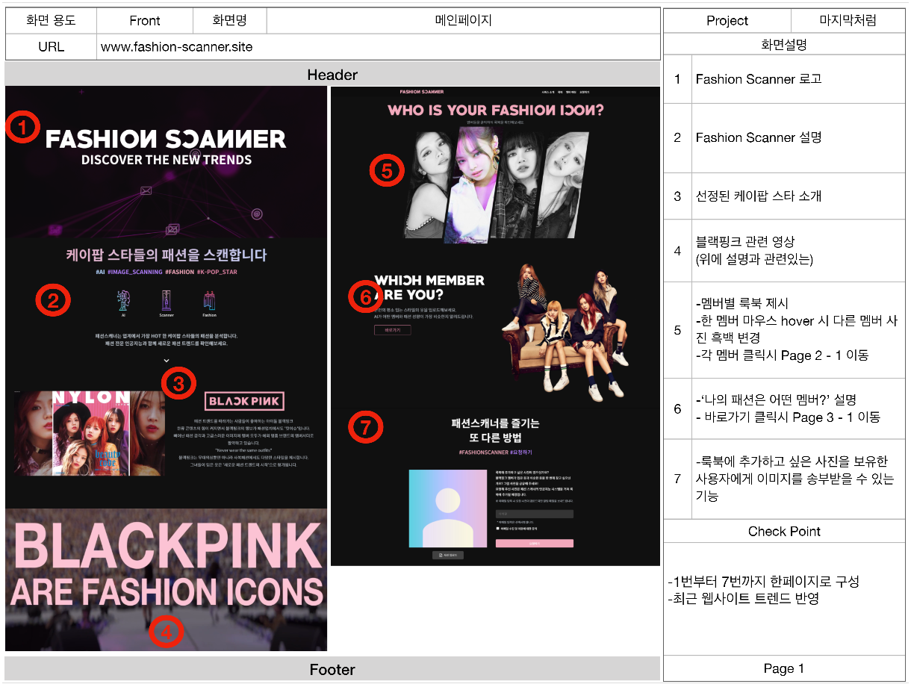
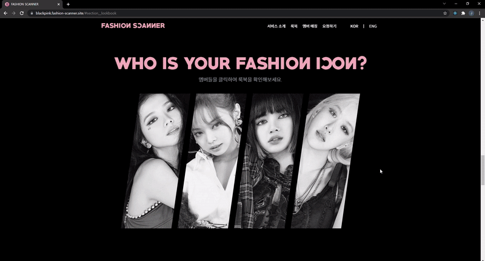
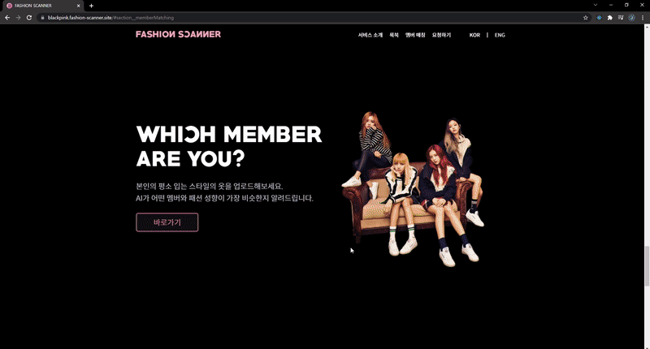
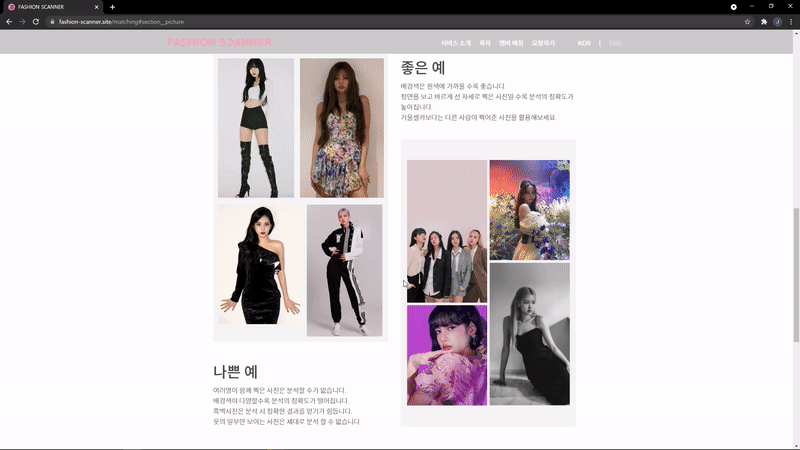
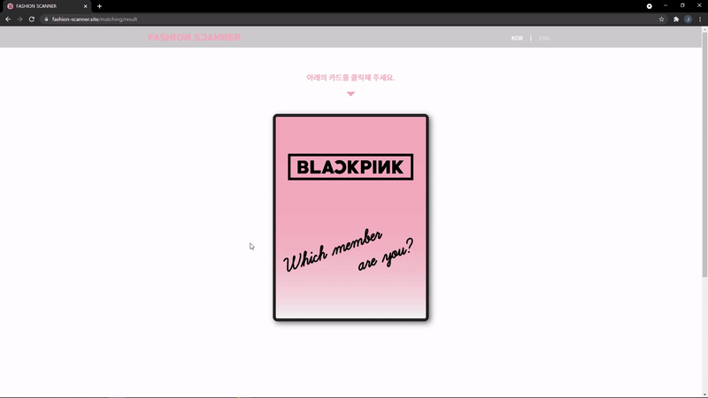
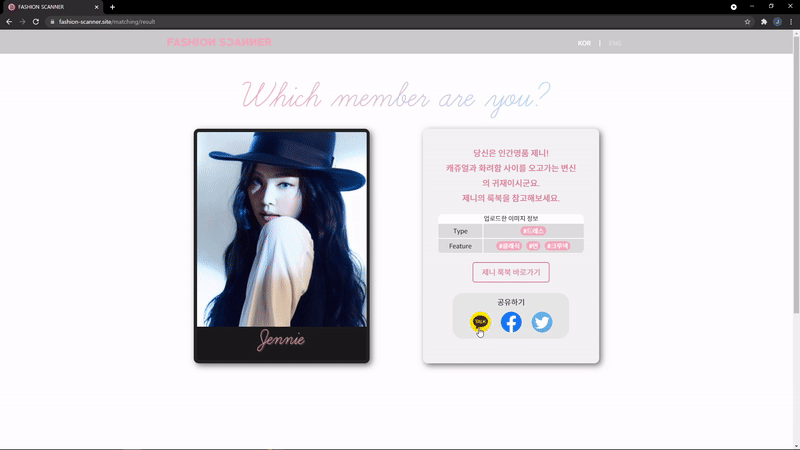
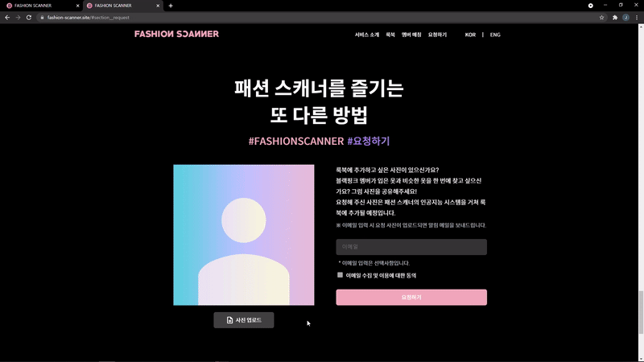
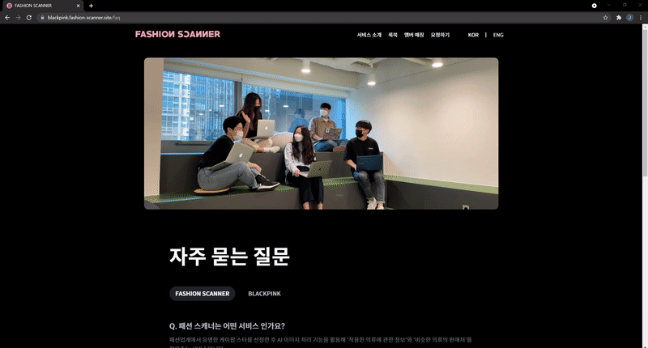
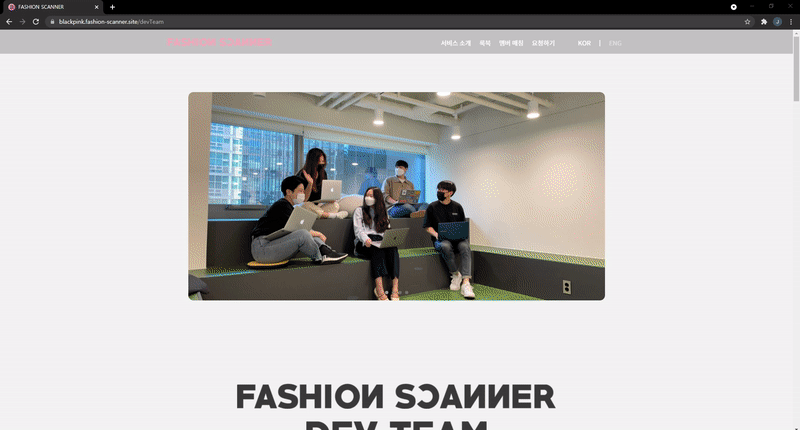
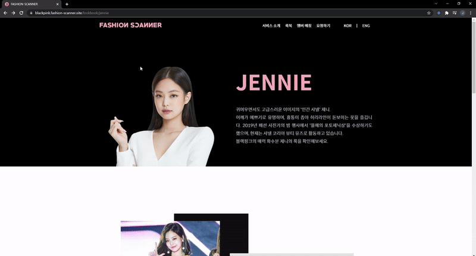

<div align="center">
  <br />
  
  <br />
  <h1>패션 스캐너 (FASHION SCANNER)</h1>
  <a href="https://blackpink.fashion-scanner.site/">
    
  </a>
  <br />
</div>

## 목차

1. [**웹 서비스 소개**](#1)
2. [**기술 스택**](#2)
3. [**주요 기능**](#3)
4. [**프로젝트 구성도**](#4)
5. [**주요 페이지**](#5)
6. [**개발 팀 소개**](#6)
7. [**개발 기간 및 일정**](#7)
8. [**실행 방법**](#8)

<br />

<div id="1"></div>

## 💁🏻‍♂ 웹 서비스 소개

&nbsp;&nbsp;**AI X FASHION X K-POP STAR** 총 3가지 키워드의 집합.
<br />
&nbsp;&nbsp;패션업계에서 유명한 케이팝 스타를 선정한 뒤 AI 이미지처리 기능을 활용해 `'해당인물이 착용한 의류에 관한 정보'`와 `'비슷한 의류의 판매처'`를 찾아주는 서비스
<br />

> 첫번째 버전은 케이팝 스타중 가장 패션계에서 영향력이 있다고 평가되는 '블랙핑크'로 선정하였습니다.

<details>
  <summary>타겟층</summary>
  <div markdown="1">
    <ul>
      <li>패션 트렌드에 민감한 20/30 대 여성, 블랙핑크 국내외 팬들.</li>
    </ul>
  </div>
</details>

<details>
  <summary>문제 정의</summary>
  <div markdown="1">
    <ul>
      <li>케이팝스타가 착용한 패션은 대중으로부터의 워너비 현상을 만들어내는 주요한 요소이나 현재까지 그들과 비슷하게 옷을 입기위해서는 사람이 일일이 검색을 해야한다.</li>
    </ul>
  </div>
</details>

<details>
  <summary>가설 설정 방법</summary>
  <div markdown="1">
    <ul>
      <li>시대의 패션 아이콘으로 평가되는 '블랙핑크'의 패션을 AI를 활용해 의류 카테고리를 분류하고 비슷한 의류를 추천한다. 더 나아가 판매 링크까지 연결하는 서비스를 제공하여 타겟층이 블랙핑크가 착용한 의류와 비슷한 의류를 구매할 수 있도록 한다. 또한, 워너비 현상을 이용해 본인의 패션 스타일과 일치하는 블랙핑크 멤버를 출력함으로 사이트 이용 흥미도를 높일 수 있다.</li>
    </ul>
  </div>
</details>

<details>
  <summary>추가 기대 효과</summary>
  <div markdown="1">
    <ul>
      <li>타겟층의 트래픽을 유도해서 광고 수익을 창출할 수 있다. 더 나아가 패션관련 케이팝스타마다 존재하는 웹 서비스로서의 역할을 할 수 있다.</li>
    </ul>
  </div>
</details>

<br />

[**🔗 배포된 웹 서비스로 바로가기 Click !**](https://blackpink.fashion-scanner.site/) 👈

> 새 창 열기 방법 : CTRL+click (on Windows and Linux) | CMD+click (on MacOS)

<br />

<div id="2"></div>

## 🛠 기술 스택

**Front-end**

-   
- 
- 

**Back-end**

- 
- 
- 

**AI**

- 

**DevOps**

-  
-   

**Data-set**

- DeepFashion 데이터
- 아마존(US) 크롤링 데이터

<br />

<div id="3"></div>

## 💡 주요 기능

|       기능        |                                               내용                                                |
| :---------------: | :-----------------------------------------------------------------------------------------------: |
| 룩북 페이지 제공  | 룩북 페이지를 제공하여 멤버들이 사진에서 입고 있는 옷과<br />유사한 옷들을 제시하고 판매처를 연결 |
| 멤버 매칭 서비스  |   사용자의 스타일링 사진을 업로드 시<br />사용자의 패션과 유사한 패션 스타일을 가진 멤버를 매칭   |
|    요청 서비스    |             사용자가 운영진에게 추가를 원하는 이미지를 요청 보낼 수 있는 수 있는 기능             |
| 한/영 페이지 제공 |                          글로벌 사용자 유입을 위해 한영 페이지 모두 구현                          |

> 패션 스캐너 웹 서비스는 **반응형 웹**을 구축하여 **모바일 환경에서도 최적의 서비스를 제공**하고 있습니다.

<br />

<div id="4"></div>

## 📂 프로젝트 구성도

| [🔗와이어프레임(Wireframe)](https://www.figma.com/file/UpQVmuk7wFVKmdUTBRpiTZ/%EB%B8%94%EB%9E%99%ED%95%91%ED%81%AC-LookBook?node-id=0%3A1) |
| :----------------------------------------------------------------------------------------------------------------------------------------: |
|                                                                         |

|       [🔗스토리보드](./documents/fashion-scanner_storyboard.pdf)        |
| :---------------------------------------------------------------------: |
|  |

|                          아키텍처(Architecture)                           |
| :-----------------------------------------------------------------------: |
|  |

|                   개체-관계 모델(ERD)                   |
| :-----------------------------------------------------: |
|  |

<br />

<div id="5"></div>

## 📄 주요 페이지

|                          메인 페이지                          |
| :-----------------------------------------------------------: |
|  |

|                                 룩북 페이지                                  |
| :--------------------------------------------------------------------------: |
|  |
|   |

|                             매칭 페이지                             |
| :-----------------------------------------------------------------: |
|  |
|  |
|  |
|  |

|                         요청 서비스                         |
| :---------------------------------------------------------: |
|  |

|                         FAQ 페이지                          |
| :---------------------------------------------------------: |
|  |

|                           조직문화 페이지                            |
| :------------------------------------------------------------------: |
|  |

|                         404 에러 페이지                          |
| :--------------------------------------------------------------: |
|  |

|                   영문 메인 페이지 (영문 전환 기능)                    |
| :--------------------------------------------------------------------: |
|  |

|                                    메인 페이지(모바일)                                     |                                      룩북 페이지(모바일)                                       |
| :----------------------------------------------------------------------------------------: | :--------------------------------------------------------------------------------------------: |
|  |  |

|                                      매칭 페이지(모바일)                                       |                                    FAQ 페이지(모바일)                                    |
| :--------------------------------------------------------------------------------------------: | :--------------------------------------------------------------------------------------: |
|  |  |

|                                      조직문화 페이지(모바일)                                      |
| :-----------------------------------------------------------------------------------------------: |
|  |

<br />

<div id="6"></div>

## 👪 개발 팀 소개

|  이름  |   역할    |                                                                                        개발 내용                                                                                        |
| :----: | :-------: | :-------------------------------------------------------------------------------------------------------------------------------------------------------------------------------------: |
| 차시현 |  PM & AI  |                           프로젝트 문서 작성<br />스토리보드 작성<br />아마존 쇼핑몰 데이터 크롤링<br />딥패션 데이터 활용한 모델 1, 모델 2 개발<br />UX 작성                           |
| 이찬미 |    AI     |                                                        아마존 쇼핑몰 데이터 크롤링<br />딥패션 데이터 활용한 모델 1, 모델 2 개발                                                        |
| 박정환 | Front-end | 메인 페이지 개발(+반응형 웹)<br />멤버 매칭 페이지 개발(+반응형 웹)<br />매칭 실패 페이지 개발(+반응형 웹)<br />매칭 결과 페이지 개발(+반응형 웹)<br />조직문화 페이지 개발(+반응형 웹) |
| 김수연 | Front-end |            멤버별 룩북 페이지 개발(+반응형 웹)<br />FAQ 페이지 개발(+반응형 웹)<br />로딩 페이지 개발(+반응형 웹)<br />404 페이지 개발(+반응형 웹)<br />한/영 전환 기능 개발            |
| 이보람 | Back-end  |                                                         룩북 API 설계<br />멤버 매칭 API 설계<br />DB 설계<br />웹 서비스 배포                                                          |

<br />

<div id="7"></div>

## 📅 개발 기간 및 일정

- **개발 기간**

  `21.05.11 ~ 21.06.11 (5주)`

- **개발 일정**

  | 주차  |                                               내용                                                |
  | :---: | :-----------------------------------------------------------------------------------------------: |
  | 1주차 |    기획안 확정<br />와이어프레임 및 스토리보드 작성<br />아키텍처 설계<br />인공지능 환경 셋업    |
  | 2주차 |                 메인 페이지 개발<br />룩북 페이지 개발<br />인공지능 데이터 정제                  |
  | 3주차 |            메인 페이지 개발<br />룩북 페이지 개발<br />매칭 페이지 개발<br />API 설계             |
  | 4주차 | FAQ 페이지 개발<br />조직 문화 페이지 개발<br />반응형 웹 구현<br />404 페이지 개발<br />API 연결 |
  | 5주차 |                      반응형 웹 구현<br />한/영 전환 구현<br />웹 서비스 배포                      |

<br />

<div id="8"></div>

## 💻 실행 방법

### client

```bash
// client 폴더 위치에서
// 프론트 [운영 모드] 도커 이미지 빌드
docker build -t [이미지 이름] -f Dockerfile_prod .

// client 폴더 위치에서
// 프론트 [운영 모드] 컨테이너 실행
 docker run --rm -d --name [컨테이너 이름] -v '/etc/letsencrypt:/etc/letsencrypt' -v '/var/lib/letsencrypt:/var/lib/letsencrypt' -p 80:80 -p 443:443 [이미지 이름]
```

### server

```bash
// server 폴더 위치에서 아래 두 개의 명령어 중 원하는 모드로 명령 실행
// 서버 [개발 모드] 도커 이미지 빌드
docker-compose build
// 서버 [운영 모드] 도커 이미지 빌드
docker-compose -f docker-compose.prod.yml build

// server 폴더 위치에서 아래 두 개의 명령어 중 원하는 모드로 명령 실행
// 서버 [개발 모드] 컨테이너 실행
docker-compose up
// 서버 [운영 모드] 컨테이너 실행
docker-compose -f docker-compose.prod.yml up
```
